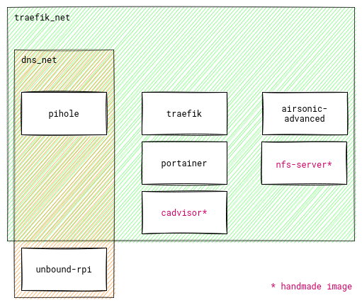

# magpie

magpie is a simple homelab setup - a bunch of Docker services
deployed on a single host:

- [Raspberry Pi 4 model B (rev 1.1)](https://www.raspberrypi.com/products/raspberry-pi-4-model-b/)
  running Raspberry Pi OS Lite
- 64Gb SD Card

Below is a diagram of the Docker Compose stacks and respective containers:

## Setup

### Docker services

There was a lot of messing around before establishing documentation...
_Probably_, this:

1. Install Docker
2. Install Docker Compose
3. `docker compose up/down` as needed

This likely also involves installing/updating system packages,
enabling system services, and some _very_ careful configuration
(i.e. whatever the blog post you're following says).

### Diagram

The architecture diagram above is generated using `diagram.py` and uses the
[Diagrams Python package](https://diagrams.mingrammer.com/).

To setup the required environment and generate the diagram:

1. Install [Graphviz](https://graphviz.gitlab.io/), preferably using your system package manager
2. `pip install diagrams`
3. `python diagram.py`

### pre-commit

The project includes a couple of [pre-commit](https://pre-commit.com/) hooks;
the most relevant is likely the [hadolint](https://github.com/hadolint/hadolint) one.

1. Install pre-commit
2. Run `pre-commit install` to install this project's hooks

I should probably run `pre-commit autoupdate` from time to time.
